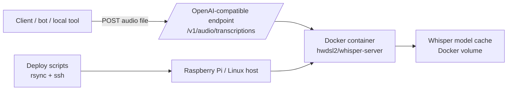

# transcription-server

A minimal Raspberry Pi deployment wrapper for [`hwdsl2/docker-whisper`](https://github.com/hwdsl2/docker-whisper), giving you a simple OpenAI-compatible transcription endpoint plus deploy/sync/restart scripts for a self-hosted box.

This repo is intentionally thin. It does **not** replace the upstream Whisper server; it packages a deployment pattern that is easy to reuse for local automation and bot workflows.

## Why this exists

The upstream server solves the core speech-to-text problem well. What this repo adds is the operational wrapper around it:

- opinionated Docker Compose deployment
- a small SSH + rsync deploy workflow
- host-specific overrides kept out of git
- a predictable OpenAI-compatible `/v1/audio/transcriptions` endpoint
- a simple path for integrating self-hosted STT into local tools and agents

## What it is good for

- self-hosted speech-to-text on a Raspberry Pi or small Linux box
- local automation, bots, and agent workflows
- private audio transcription without depending on a hosted API
- a minimal deployment surface that is easy to inspect and modify

## Non-goals

- building a new ASR engine
- replacing the upstream `docker-whisper` project
- public-Internet hardening by default
- multi-node orchestration or multi-tenant hosting

## Architecture



## Current default behavior

- Image: `hwdsl2/whisper-server@sha256:94dc52fe65de35d20cf1e14be9805c471552e28aba1b71b582d7d685106850c4`
- Model: `base.en`
- Language: `en`
- Device: CPU / INT8
- Container restart policy: `unless-stopped`
- Safer network default: binds to `127.0.0.1:9000`

## Files

- `docker-compose.yml` — pinned deployment config with safe public defaults
- `.env.example` — optional host-specific Docker Compose overrides (copy to `.env`)
- `whisper.env.example` — runtime env template for the upstream container
- `scripts/sync-to-pi.sh` — rsync the repo to a remote host
- `scripts/deploy-to-pi.sh` — sync + ensure env + create cache volume + deploy
- `scripts/restart-on-pi.sh` — restart the service remotely
- `scripts/status-on-pi.sh` — inspect running status + restart policy
- `scripts/logs-on-pi.sh` — tail recent logs

## Quick start

### 1) Prepare the repo

```bash
cp whisper.env.example whisper.env
cp .env.example .env
```

Edit `whisper.env` to set a real API key.

If you want the service reachable from other machines on your LAN, change:

```bash
WHISPER_BIND_ADDR=0.0.0.0
```

in `.env`.

### 2) Start locally

Create the cache volume once:

```bash
docker volume create "$(grep '^WHISPER_MODEL_CACHE_VOLUME_NAME=' .env | cut -d= -f2-)"
```

Then start the service:

```bash
docker compose up -d
```

### 3) Transcribe audio

```bash
curl -sS \
  -H "Authorization: Bearer YOUR_API_KEY" \
  -F file=@sample.wav \
  -F model=whisper-1 \
  -F language=en \
  -F response_format=text \
  http://127.0.0.1:9000/v1/audio/transcriptions
```

## Host-specific overrides

This repo keeps machine-specific deployment details out of git.

- `.env` is for Docker Compose host overrides like bind address, host port, and volume name
- `whisper.env` is for runtime server settings like model, language, compute type, and API key
- both files are gitignored

That means you can keep a private deployment override for your own host while the tracked repo stays safe and reusable.

### Example: LAN-visible deployment override

```bash
WHISPER_BIND_ADDR=0.0.0.0
WHISPER_HOST_PORT=9000
WHISPER_MODEL_CACHE_VOLUME_NAME=transcription-server-whisper-data
```

## Deploy to a remote Raspberry Pi or Linux host

```bash
./scripts/deploy-to-pi.sh my-host-alias /srv/transcription-server
```

What it does:

1. rsyncs the repo to the remote host
2. preserves remote `.env` and `whisper.env`
3. creates the cache volume if needed
4. pulls the pinned image
5. restarts the service with Docker Compose

## Security notes

- The default tracked config binds to `127.0.0.1`, not all interfaces.
- If you change the bind address to `0.0.0.0`, put the service behind a trusted LAN, VPN, or reverse proxy.
- This repo does **not** configure TLS for you.
- The bearer token lives in `whisper.env`; keep that file private.
- For Internet-facing deployments, add HTTPS and avoid exposing port 9000 directly.

## Why not just use the upstream repo?

You probably should start there if you only need the server itself.

Use this repo when you want:

- a minimal deployment wrapper you can fork quickly
- a tiny operational surface for a Pi or single host
- a clear place to add your own integration-specific scripts

## License

MIT. See [`LICENSE`](./LICENSE).
