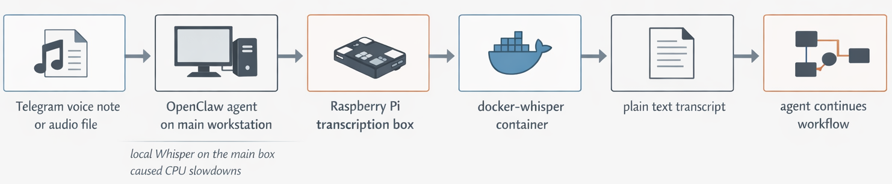

# transcription-server

A small self-hosted transcription box for local tools.

I built this because I wanted an OpenClaw agent to hand a voice note to a Raspberry Pi, get text back, and keep going. Running Whisper on the same machine as OpenClaw turned out to be a bad fit: transcription was CPU-heavy enough that one audio job could make every active session crawl. This repo packages the deployment and day-2 operations so local transcription can live on its own box and stay boring in the best way.

One common use case: an OpenClaw agent receives a Telegram voice note, posts the audio to a local Pi, gets back a transcript, and continues the workflow without touching a hosted STT API.

## Architecture

This repo is mostly about the local handoff. The HTTP endpoint matters because it makes the integration easy, but the real win is simpler than that: keep transcription off the main box so the agent can keep moving.



## At a glance

- This is a thin deployment wrapper around [`hwdsl2/docker-whisper`](https://github.com/hwdsl2/docker-whisper).
- It is good for local agents, local scripts, and private speech-to-text on a Pi or small Linux box.
- It is not a new ASR engine, not a hosted SaaS, and not a hardened public-Internet deployment.

## Quick start

### 1) Prepare local config

```bash
cp whisper.env.example whisper.env
cp .env.example .env
```

Set a real API key in `whisper.env`.

By default, the tracked config binds the service to `127.0.0.1:9000`. That is the safe default.

If you want other machines on your LAN to reach it, change this in `.env`:

```bash
WHISPER_BIND_ADDR=0.0.0.0
```

### 2) Create the model cache volume

If you are using the default `.env.example`, run:

```bash
docker volume create transcription-server-whisper-data
```

If you changed `WHISPER_MODEL_CACHE_VOLUME_NAME`, create that volume name instead.

### 3) Start the service

```bash
docker compose up -d
```

### 4) Transcribe a file with the default client helper

```bash
./scripts/transcribe-file.sh /path/to/audio.ogg
```

This is the intended default way to use the server from a local script or agent client.
It posts the audio file to the server, auto-derives a sensible timeout from the file duration, and still lets you override the timeout explicitly if you need to.

### 5) Or call the HTTP API directly

```bash
curl -sS \
  -H "Authorization: Bearer YOUR_API_KEY" \
  -F file=@sample.wav \
  -F model=whisper-1 \
  -F language=en \
  -F response_format=text \
  http://127.0.0.1:9000/v1/audio/transcriptions
```

If the service is bound to `0.0.0.0`, replace `127.0.0.1` with your host's LAN IP or hostname.

## Why this exists

The upstream project gives you the server. What I wanted was the rest of the operational story:

- a tiny repo I could inspect in a minute
- one obvious deploy path for a Raspberry Pi
- local overrides kept out of git
- predictable restart, logs, and status commands
- a clean way for an OpenClaw agent or any local script to use self-hosted transcription

That is what this repo is for. Not more than that.

## What it is good for

This repo makes sense if you want:

- self-hosted speech-to-text on a Pi or small Linux box
- a local endpoint for agents, bots, or scripts
- private transcription without wiring in a hosted API
- a deployment wrapper you can fork and modify quickly

## Non-goals

This repo is probably the wrong choice if you want:

- a brand new speech-to-text engine
- a polished public cloud product
- multi-node orchestration
- multi-tenant auth and billing
- Internet-facing hardening out of the box

If you only want the server itself, the upstream repo is the better starting point.

## Host-specific overrides

Machine-specific deployment details stay out of git.

- `.env` controls Docker Compose host overrides such as bind address, host port, and cache volume name
- `whisper.env` controls runtime server settings such as model, language, compute type, and API key
- both files are gitignored

That split is deliberate. The tracked repo stays reusable, while your real deployment can keep its own private override values.

Example LAN-visible `.env`:

```bash
WHISPER_BIND_ADDR=0.0.0.0
WHISPER_HOST_PORT=9000
WHISPER_MODEL_CACHE_VOLUME_NAME=transcription-server-whisper-data
```

## Remote deploy to a Pi or Linux host

```bash
./scripts/deploy-to-pi.sh my-host-alias /srv/transcription-server
```

What the deploy script does:

1. rsyncs the repo to the remote host
2. preserves remote `.env` and `whisper.env`
3. creates the Docker volume if needed
4. pulls the pinned image
5. restarts the service with Docker Compose

## How this fits into a local-tool workflow

The motivating workflow for me looked like this:

1. a local agent receives an audio file or voice note
2. the agent sends that file to this service
3. the service returns plain text
4. the rest of the workflow stays local and scriptable

The nice part is not the HTTP endpoint by itself. The nice part is that the transcription box becomes predictable. You know where it runs, how it is deployed, where the model cache lives, and how to restart it when something goes sideways.

## Default client helper

This repo includes a local client script so users do not need to reconstruct the API call every time:

```bash
./scripts/transcribe-file.sh /path/to/audio.ogg
```

That wrapper delegates to the duration-aware implementation:

```bash
./scripts/transcribe-file-via-server.sh /path/to/audio.ogg
```

The duration-aware behavior is the default for all files, not just long ones:

- if `STT_PI_TIMEOUT` is set, that exact timeout is used
- otherwise timeout = `ceil(audio_duration_seconds) + STT_PI_TIMEOUT_PAD`
- the auto-derived timeout is clamped to at least `STT_PI_TIMEOUT_MIN`

Default values:

- `STT_PI_TIMEOUT_PAD=420`
- `STT_PI_TIMEOUT_MIN=1200`

Local prerequisites for the client helper:

- `curl`
- `ffmpeg`
- `ffprobe`
- `python3`
- `ssh` when using auto-discovery or remote API-key lookup

Useful overrides:

```bash
STT_PI_TIMEOUT=3600 ./scripts/transcribe-file.sh /path/to/audio.ogg
STT_PI_TIMEOUT_PAD=600 ./scripts/transcribe-file.sh /path/to/audio.ogg
STT_PI_TIMEOUT_MIN=1800 ./scripts/transcribe-file.sh /path/to/audio.ogg
STT_PI_DEBUG=1 ./scripts/transcribe-file.sh /path/to/audio.ogg
```

## Files

- `docker-compose.yml` — pinned deployment config with safe tracked defaults
- `.env.example` — optional host-specific Docker Compose overrides
- `whisper.env.example` — runtime env template for the upstream container
- `scripts/transcribe-file.sh` — canonical local client entrypoint for posting audio to the server
- `scripts/transcribe-file-via-server.sh` — duration-aware implementation used by the default client helper
- `scripts/sync-to-pi.sh` — rsync the repo to a remote host
- `scripts/deploy-to-pi.sh` — sync, preserve env, create volume, and deploy
- `scripts/restart-on-pi.sh` — restart the service remotely
- `scripts/status-on-pi.sh` — inspect running status and restart policy
- `scripts/logs-on-pi.sh` — tail recent logs

## Security notes

A few blunt notes, because this is where people get sloppy:

- The tracked default binds to `127.0.0.1`, not all interfaces.
- If you switch to `0.0.0.0`, treat it like a deliberate choice, not a default.
- This repo does not configure TLS for you.
- The bearer token lives in `whisper.env`; keep that file private.
- If you expose this beyond a trusted LAN or VPN, put a real reverse proxy in front of it and stop pretending raw port 9000 is enough.

## Why not just use the upstream repo?

You probably should, if all you need is the server.

This repo exists for the case where you want the smallest possible deployment wrapper around that upstream work, plus a few operational conveniences that make it pleasant to use from local automation.

## License

MIT. See [`LICENSE`](./LICENSE).
